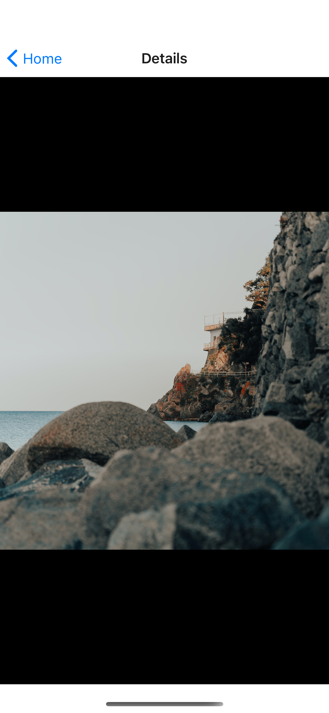

# Photobooth
##### It's a cross platform react native photo gallery app that uses Unsplash api to store &amp; show images.
##### App UI Screens
 &emsp; &emsp;  &emsp; &emsp;  
 
 
 &emsp; &emsp;   &emsp; &emsp; 

 
 

 
 
 
### Tools & libraries used in this project: 
- React native 
- Javascript fetch
- Redux
- Jest

#### Note: Additionally I handled some extra tasks such as network accessibility check & render proper UI state based on it, Api unit testing & response handling.
